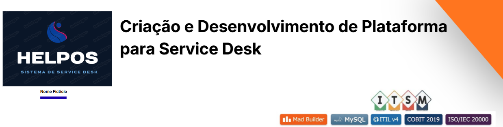
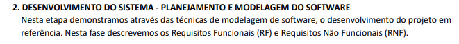
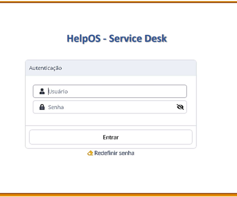

Help OS — Criação e Desenvolvimento de Plataforma para Service Desk 

  

**Natureza:** Acadêmico / Laboratorial / Simulação Corporativa ✔

---

## Visão Geral

Em um cenário onde a tecnologia é essencial para as operações empresariais, o Service Desk  surge como um componente crítico, atuando como o principal ponto de contato entre usuários e serviços de TI.

O projeto descreve o Desenvolvimento de um sistema de gestão de serviços de TI (HelpOS) com aplicação prática de frameworks de governança de TI (ITIL, COBIT e ISO 20000) e Engenharia de Software, com foco em automação de incidentes e workflows de SLA.

HelpOS é uma plataforma centralizada de Service Desk desenvolvida para gerenciar o ciclo de vida completo de incidentes e requisições de TI.

## Contexto e Problema

As Organizações que operam sem um sistema estruturado de Service Desk enfrentam desafios como falta de padronização no atendimento, dificuldade de rastreamento de incidentes, ausência de métricas de desempenho e baixa visibilidade sobre a qualidade dos serviços de TI. 
Para evoluir a maturidade em gestão de serviços, é necessário implementar uma plataforma que centralize demandas, automatize processos e forneça indicadores para melhoria contínua. HelpOS

## Objetivos

- Centralizar a gestão de incidentes e requisições de serviços de TI.
- Automatizar workflows de atendimento baseados em ITIL e COBIT.
- Implementar categorização, priorização e rastreamento de chamados.
- Fornecer dashboards para monitoramento de SLA e desempenho da equipe.

## Escopo

- **Inclusões:** Desenvolvimento SDLC completo, automação de incidentes, gestão de portfólio de serviços, workflows de aprovação, categorização de chamados, sistema de priorização, anexos de arquivos, relatórios e dashboards.  
- **Exclusões:** Integração física com hardware externo de terceiros, desenvolvimento de aplicativos móveis nativos.  
- **Limites:** Cenário de simulação corporativa desenvolvido em ambiente acadêmico, sem impacto em operações de produção.

## Papel e Responsabilidades

Atuação no desenvolvimento da plataforma HelpOS, abrangendo modelagem de dados, implementação de workflows de atendimento, parametrização de regras de SLA, desenvolvimento de dashboards gerenciais e elaboração da documentação técnica do sistema.

## Metodologia e Abordagem

O projeto foi conduzido em fases estruturadas de engenharia de software:
1. **Planejamento e Arquitetura:** Definição de requisitos funcionais e não-funcionais, modelagem de dados (DER, Diagrama de Classes) e arquitetura da plataforma.

  

2. **Desenvolvimento de Workflows e SLA:** Implementação de fluxos de atendimento, regras de priorização (impacto x urgência), categorização de chamados e definição de SLAs.

3. **Implementação do Sistema:** Desenvolvimento da interface de login, dashboard administrativo, formulários de abertura de chamados, listagem de tickets e sistema de resolução.

4. **Testes de Performance e Segurança:** Validação de funcionalidades, testes de usabilidade e verificação de conformidade com requisitos de segurança.

5. **Entrega e Documentação:** Disponibilização de ambiente funcional, documentação técnica e vídeo de apresentação (pitch).

## Frameworks e Boas Práticas

  
  
  

- **ITIL 4:** Aplicado para estruturação do gerenciamento de incidentes, requisições de serviço, priorização de chamados e definição de SLAs.
- **COBIT 2019:** Utilizado para alinhamento entre TI e negócio, governança de serviços e definição de métricas de desempenho.
- **ISO 20000:** Diretriz para padronização de processos de gestão de serviços e melhoria contínua.

## Tecnologias e Ferramentas

  
  
 

 
- **Desenvolvimento:** Mad Builder (low-code), HTML, CSS, JavaScript.
- **Banco de Dados:** MySQL/PostgreSQL (modelagem relacional).
- **Ferramentas de Modelagem:** Draw.io, BrModelo.
- **Gestão e Versionamento:** GitHub.
- **Infraestrutura Conceitual:** Terraform, Ansible, Kubernetes, Docker, AWS/Azure.

## Solução e Arquitetura

A plataforma foi desenvolvida com arquitetura modular e interface web responsiva. O sistema inclui:
- **Módulo de Autenticação:** Login seguro com controle de perfis (Administrador, Atendente, Cliente/Usuário).
- **Módulo de Chamados:** Abertura, categorização, priorização, atribuição e resolução de incidentes.
- **Workflows Automatizados:** Fluxos de aprovação, notificações e escalonamento baseados em regras de SLA.
- **Dashboards Gerenciais:** Visualização de métricas como tickets abertos/fechados, tempo médio de resolução (MTTR), top clientes, top produtos e distribuição por prioridade/categoria.
- **Relatórios e Exportação:** Geração de relatórios em PDF, XLS, XML e CSV para análise de dados.

  

  

## Evidências e Entregáveis

- **Sistema Funcional HelpOS:** Plataforma completa com login, dashboard, abertura de chamados, listagem de tickets e resolução de incidentes.
- **Modelagem de Dados Completa:** DER, Diagrama de Classes, modelo lógico e físico de banco de dados.
- **Requisitos Funcionais e Não-Funcionais:** Documentação detalhada de RFs e RNFs alinhados a ITIL.
- **Catálogo de Serviços ITIL:** Estrutura de produtos e categorias de atendimento (Hardware, Software, Rede, E-mail, Telefonia, etc.).
- **Vídeo de Apresentação (Pitch):** Demonstração completa das funcionalidades do sistema.
- **Documentação Técnica:** Arquitetura, fluxos de trabalho, regras de SLA e manual de uso.

*[Espaço reservado para inserção de screenshots do sistema, diagramas de arquitetura e link para o vídeo de apresentação]*

  

  

## Resultados e Validação

- Sistema de Service Desk funcional desenvolvido e testado em ambiente de simulação.
- Implementação de workflows de atendimento alinhados a ITIL (abertura → atendimento → resolução → fechamento).
- Categorização e priorização de chamados baseadas em impacto e urgência.
- Dashboards gerenciais com métricas de desempenho (tickets abertos/fechados, MTTR, satisfação).
- Conformidade com requisitos de governança ITIL, COBIT e ISO 20000 documentada.

Resultados
Validação de um sistema de Service Desk funcional em ambiente de simulação, evidenciando a aplicação prática de workflows de atendimento integrados, categorização de chamados por impacto e urgência, e monitoramento de indicadores de desempenho por meio de dashboards gerenciais.

  

  

---

## 📂 Documentação, Evidências e Recursos

- [Catálogo de Serviços de TI (ITIL/SLA)](docs/CATALOGO_DE_SERVICOS_ITIL.md)
- [Guia do Sistema/Manual de Instruções](docs/guiadosistema.pdf)
- [Modelagem Software UML- HelpOS](docs/modelagem.pdf)
- [Funcionalidades Tecnicas do Sistema HelpOS](docs/funcionalidadestecnicas.png)
- [Link para a Documentação Técnica Completa (PDF)](docs/helpos.pdf)
- [Vídeo de Apresentação (Pitch)](https://drive.google.com/file/d/1YI5i8aG8hYqAZ9ODPbYkuW7EJSWT_x0k/view?usp=sharing)
- [Link para Apresentação do Sistema Mad Builder](https://www.youtube.com/watch?v=0vQxkoLHeEQ)

---

## Contato

---

## 🧭 Navegação do Portfólio

[⬅️ Voltar ao Perfil Principal](https://github.com/mighcruz) 

[📂 Voltar ao Hub Central de Projetos](https://github.com/mighcruz/portfolio-ti)

---

###### 🔒 Nota de Confidencialidade

###### *Tratando-se de um projeto desenvolvido em ambiente de simulação corporativa e laboratório de testes, quaisquer topologias de rede, endereços IP, credenciais de acesso ou configurações específicas mencionadas na documentação original foram omitidas ou sanitizadas neste repositório, preservando as boas práticas de segurança da informação.*
